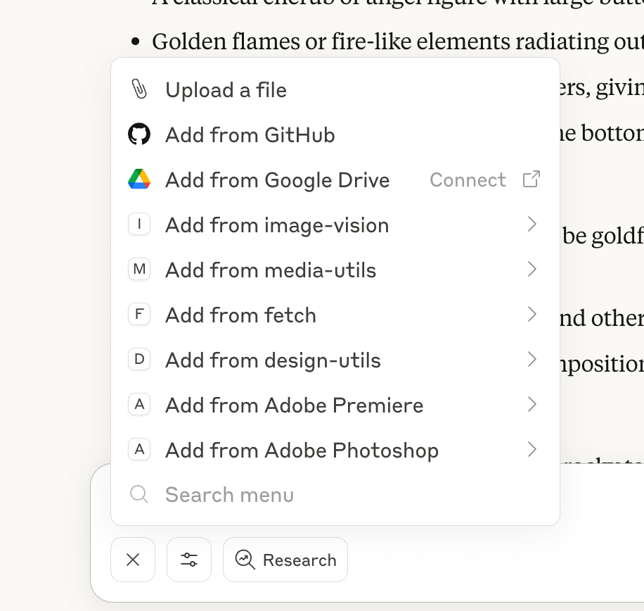

# adb-mcp

adb-mcp는 MCP 프로토콜을 통해 LLM(대형 언어 모델)과 인터페이스를 제공하여 Adobe Photoshop과 Adobe Premiere를 제어할 수 있는 AI 에이전트 PoC(개념 증명) 프로젝트입니다.

이 프로젝트는 Adobe에서 공식적으로 지원하거나 보증하지 않습니다.

Mac과 Windows의 Claude 데스크톱(Anthropic) 및 OpenAI Agent SDK에서 테스트되었으며, MCP 프로토콜을 지원하는 모든 AI 앱/LLM과 이론적으로 호환됩니다. 여러 Adobe 애플리케이션을 지원할 수 있도록 설계되었습니다.

예시 사용 사례:

-   Claude에게 Photoshop에서 단계별 작업을 지시하여 대화형 인터페이스로 활용(특히 Photoshop 초보자에게 유용)
-   Claude에게 특정 작업(예: 폴라로이드 스타일 인스타그램 포스트, 더블 노출 이미지 등)을 맡기고, 템플릿으로 활용할 수 있는 결과물을 생성
-   Claude에게 맞춤형 Photoshop 튜토리얼을 생성하도록 요청(예제 파일 생성 후, 재현 방법 단계별 안내)
-   Photoshop의 모든 레이어를 일관된 형식으로 자동 이름 변경 등 유틸리티 도구로 활용
-   Claude가 미리 클립, 전환, 효과, 오디오가 포함된 새로운 Premiere 프로젝트 생성

[동영상 예시 보기](https://www.youtube.com/playlist?list=PLrZcuHfRluqt5JQiKzMWefUb0Xumb7MkI)

Premiere 에이전트는 현재 Premiere 플러그인 API의 한계로 인해 Photoshop 에이전트보다 기능이 제한적입니다.

## 작동 방식

이 PoC는 다음과 같이 구성됩니다:

-   MCP 서버: AI/LLM이 Adobe Photoshop 기능에 접근할 수 있도록 인터페이스 제공
-   Node 기반 명령 프록시 서버: MCP 서버와 Adobe 앱 플러그인 사이에서 중계 역할
-   Adobe 앱(Photoshop, Premiere) 플러그인: 명령을 수신하고 프로그램을 제어

**AI** <-> **MCP 서버** <-> **명령 프록시 서버** <-> **Photoshop/Premiere UXP 플러그인** <-> **Photoshop/Premiere**

프록시 서버가 필요한 이유는, UXP 기반 JS 플러그인은 MCP 서버가 연결할 수 있는 소켓 서버로 동작할 수 없고, 클라이언트로만 소켓에 연결할 수 있기 때문입니다.

## 요구 사항

실행을 위해서는 다음이 필요합니다:

-   MCP 프로토콜을 지원하는 AI LLM(Claude 데스크톱, OpenAI Agent SDK 등에서 테스트됨)
-   Python 3 (MCP 서버 실행용)
-   NodeJS (MCP 서버와 Photoshop 사이의 프록시 서버 실행용)
-   Adobe UXP Developer Tool (Creative Cloud에서 설치, Photoshop/Premiere 플러그인 설치 및 디버깅용)
-   Adobe Photoshop(26.0 이상) 또는 Adobe Premiere Beta(25.3 Build 46 이상) 및 MCP 플러그인

## 설치 방법

Claude 데스크톱을 기준으로 설명합니다. 다른 MCP 호환 AI 앱도 유사하게 동작합니다.

### 빠른 시작(테스트용 추천)

코드를 수정하지 않고 시스템을 빠르게 체험하고 싶을 때 사용하세요.

#### 1. 릴리즈 파일 다운로드
[릴리즈 페이지](https://github.com/mikechambers/adb-mcp/releases)에서 최신 릴리즈를 다운로드하세요:
- 소스 코드
- Claude MCP 설치 파일(.dxt)
- Adobe 플러그인(.ccx)

#### 2. Claude 데스크톱 설치
1. [Claude 데스크톱](https://claude.ai/download) 다운로드 및 설치
2. 정상 실행 확인

#### 3. Claude 데스크톱에 MCP 설치
1. Claude 데스크톱 실행
2. 해당 .dxt 파일 더블 클릭:
   - Photoshop용: `photoshop-mcp.dxt`
   - Premiere용: `premiere-mcp.dxt`
3. Claude 데스크톱 재시작

#### 4. 프록시 서버 실행
1. 소스 코드를 원하는 폴더에 압축 해제
2. 터미널/명령 프롬프트에서 `adb-proxy-socket` 폴더로 이동:
   ```bash
   cd adb-proxy-socket
   npm install
   node proxy.js
   ```
3. "Photoshop MCP Command proxy server running on ws://localhost:3001" 메시지 확인
4. **이 창은 계속 실행 상태로 두세요** (Claude와 Adobe가 통신하려면 필요)

#### 5. Adobe 플러그인 설치
1. 사용할 Adobe 앱(Photoshop 또는 Premiere) 실행
2. **Adobe UXP Developer Tools** 실행(Creative Cloud에서 설치)
3. UXP Developer Tools에서 **File > Add Plugin** 선택
4. 다운로드한 .ccx 파일 선택
5. **Load** 클릭하여 플러그인 설치
6. Adobe 앱에서 플러그인 패널 열기:
   - **Photoshop**: Plugins 메뉴
   - **Premiere Pro**: Window > UXP Plugins 메뉴
7. 플러그인 패널에서 **Connect** 클릭

### 개발 환경 설정

코드를 수정하거나 최신 기능을 사용하고 싶을 때 사용하세요.

#### 1. 소스 코드 다운로드
[메인 프로젝트 페이지](https://github.com/mikechambers/adb-mcp)에서 소스 코드 클론 또는 다운로드

#### 2. Claude 데스크톱 설치
빠른 시작 2단계와 동일

#### 3. 개발용 MCP 설치
프로젝트 디렉터리에서 다음 명령 실행:

**Photoshop용:**
```bash
uv run mcp install --with fonttools --with python-socketio --with mcp --with requests --with websocket-client --with numpy ps-mcp.py
```

**Premiere용:**
```bash
uv run mcp install --with fonttools --with python-socketio --with mcp --with requests --with websocket-client --with pillow pr-mcp.py
```

설치 후 Claude 데스크톱 재시작

#### 4. 프록시 서버 실행
빠른 시작 4단계와 동일

#### 5. Adobe 앱에서 개발자 모드 활성화

**Photoshop:**
1. Photoshop(2025/26.0 이상) 실행
2. **설정 > 플러그인**에서 **"개발자 모드 활성화"** 체크
3. Photoshop 재시작

**Premiere Pro:**
1. Premiere Pro Beta(25.3 이상) 실행
2. 베타 버전에서는 기본적으로 개발자 모드 사용 가능

#### 6. 개발용 플러그인 설치
1. **UXP Developer Tools** 실행
2. 개발자 모드 활성화
3. **File > Add Plugin** 선택
4. 해당 디렉터리에서 **manifest.json** 선택:
   - **Photoshop**: `uxp/ps/manifest.json`
   - **Premiere Pro**: `uxp/pr/manifest.json`
5. **Load** 클릭
6. Adobe 앱에서 플러그인 패널 열고 **Connect** 클릭

## Claude와 Adobe 앱 연동 사용법

다음 순서로 실행하세요:

1. Claude 데스크톱
2. adb-proxy-socket Node 서버
3. Photoshop 및/또는 Premiere 실행

_Photoshop/Premiere용 프로젝트를 Claude에서 생성하고, 앱별 안내문을 미리 로드해두면 편리합니다._

### Photoshop
1. UXP Developer Tool에서 _Photoshop MCP Agent_의 Load 버튼 클릭
2. Photoshop에서 MCP Agent 패널이 안 보이면, _Plugins > Photoshop MCP Agent > Photoshop MCP Agent_에서 열기
3. Photoshop의 에이전트 패널에서 connect 클릭

Claude 데스크톱으로 전환 후, 세션 시작 전 소켓 아이콘(Attach from MCP)을 클릭하여 안내문을 로드하세요:  
_Choose an Integration_ > _Adobe Photoshop_ > _config://get_instructions_ 선택

### Premiere
1. UXP Developer Tool에서 _Premiere MCP Agent_의 Load 버튼 클릭
2. Premiere에서 MCP Agent 패널이 안 보이면, _Window > UXP Plugins > Premiere MCP Agent > Premiere MCP Agent_에서 열기
3. Photoshop과 동일하게 connect 클릭

Claude 데스크톱에서 세션 시작 전, 소켓 아이콘(Attach from MCP) 클릭 후  
_Choose an Integration_ > _Adobe Premiere_ > _config://get_instructions_ 선택

플러그인은 Photoshop/Premiere를 재시작할 때마다 UXP Developer 앱에서 다시 로드해야 합니다.

### 세션 설정

채팅 입력창에서 "+" 버튼 클릭 → "Add from Adobe Photoshop / Premiere" 선택 → *config://get_instructions* 선택  
이 안내문을 프롬프트에 추가 후 제출하면 준비 완료!



이 과정을 거치면 AI가 앱을 사용할 때 오류가 줄어듭니다.

### 프롬프트 예시

언제든지 다음과 같이 물어볼 수 있습니다:

```
Photoshop / Premiere에서 사용할 수 있는 API/함수 목록을 알려줄 수 있나요?
```

이렇게 하면 사용 가능한 모든 기능을 안내해줍니다.

프롬프트 작성 시, API를 직접 언급할 필요 없이 자연어로 지시하면 됩니다.

예시:

```
파란색 배경, 1080x720, 300dpi의 새 Photoshop 파일을 만들어줘
```

```
인스타그램 포스트용 Photoshop 파일을 만들어줘
```

```
여자와 숲의 더블 노출 이미지를 Photoshop에서 만들어줘
```

```
숲 이미지를 생성한 뒤, 원형 클리핑 마스크로 중앙만 보이게 해줘
```
```
Photoshop으로 멋진 걸 만들어줘
```

```
Premiere 타임라인의 모든 클립 사이에 크로스 페이드 전환을 추가해줘
```

### 팁

#### 일반
* Photoshop/Premiere에서 AI가 작업한 결과 이미지는 Claude 채팅의 Tool Call 항목에서 확인할 수 있습니다.
* 프롬프트 작성 시, AI에게 작업을 점검하도록 요청하면 더 좋습니다.
* 구체적으로 지시할수록(예: "클리핑 마스크 사용 고려") 결과가 더 좋아집니다.
* 모델이 고급일수록, 리소스를 많이 할당할수록 더 창의적이고 좋은 결과를 얻을 수 있습니다.
* AI가 작업 중일 때 Adobe 앱에서 직접 변경하지 않는 것이 좋습니다. 변경했다면 AI에게 알려주세요.
* AI는 실수에서 학습하지만, 새 채팅을 시작하면 기억이 초기화됩니다. 다른 방식으로 작업하도록 유도한 뒤, 다시 시작하면 새로운 접근을 따릅니다.

현재 AI는 Photoshop/Premiere의 일부 기능만 사용할 수 있습니다. 기본적인 도구를 제공하여 AI가 복잡한 작업도 수행할 수 있도록 설계되었습니다.

Photoshop 플러그인이 Premiere보다 더 많은 기능을 지원합니다.

기본적으로 AI는 파일에 직접 접근할 수 없습니다. [Claude File System MCP server](https://www.claudemcp.com/servers/filesystem)를 설치하면 Photoshop/Premiere에서 파일을 열거나 이미지를 삽입할 수 있습니다.

#### Photoshop

* AI에게 Photoshop 파일의 내용을 확인하도록 요청할 수 있습니다.
* AI가 텍스트 크기와 위치를 정확히 지정하는 데 어려움이 있으니, 폰트 크기나 정렬 기준을 명확히 지시하면 좋습니다.
* 시스템에 설치된 모든 Postscript 폰트를 사용할 수 있습니다. 특정 폰트를 지정하려면 Postscript 이름을 사용해야 합니다.
* AI에게 아이디어나 제안을 요청해보세요. 유용한 피드백을 줄 때가 많습니다.

#### Premiere

* 현재 플러그인은 단일 시퀀스 작업만 지원합니다.
* [media-utils-mcp](https://github.com/mikechambers/media-utils-mcp)와 함께 사용하면 기능이 확장됩니다.

### 문제 해결

#### Claude에서 MCP가 실행되지 않을 때

Claude에서 MCP가 동작하지 않는다는 오류가 발생하면, Claude 설정 파일에서 UV 명령의 절대 경로를 지정해야 할 수 있습니다. 자세한 내용은 [여기](https://github.com/mikechambers/adb-mcp/issues/5#issuecomment-2829817624) 참고.

#### 모든 폰트가 보이지 않을 때

MCP 서버는 사용 가능한 폰트 목록을 반환하지만, 시스템에 폰트가 너무 많으면 일부만 표시될 수 있습니다(최대 1000개, 알파벳순).  
특정 폰트를 사용하려면 Postscript 이름을 AI에게 알려주면 됩니다.

#### 플러그인이 설치/연결되지 않을 때

* 앱이 실행 중인지 확인
* UXP Developer Tool에서 Load 옆 Debug 버튼 클릭 후 오류 확인
* Node/프록시 서버가 실행 중인지 확인. 플러그인이 연결되면 다음과 같은 메시지가 출력됩니다:
```
adb-mcp Command proxy server running on ws://localhost:3001
User connected: Ud6L4CjMWGAeofYAAAAB
Client Ud6L4CjMWGAeofYAAAAB registered for application: photoshop
```
* Connect 버튼을 눌렀는데 여전히 "Connect"로 표시되면, 오류가 있거나 프록시 서버에 연결할 수 없는 상태입니다. UXP Developer App의 Developer Workspace에서 Debug를 통해 오류 확인 가능

#### AI 클라이언트에서 오류 발생 시

* AI 쪽에서 문제가 발생하면 보통 오류 메시지가 표시됩니다. 명령/코드 박스를 클릭하면 오류를 확인할 수 있습니다.
* 문제가 있으면 우선 플러그인이 Photoshop/Premiere에 연결되어 있고, Node 프록시 서버가 실행 중인지 확인하세요.
* 응답 속도가 느려지면 AI 서버 부하나 대화 내용이 너무 많을 수 있습니다(새 채팅 시작 시 속도가 빨라질 수 있지만, 맥락이 초기화됨).

문제가 계속되면 [이슈](https://github.com/mikechambers/adb-mcp/issuesrd.gg/fgxw9t37D7)에 OS, 앱, 앱 버전, 디버그 정보, 오류 등 최대한 많은 정보를 포함해 문의해 주세요.

## 개발

새로운 기능을 추가하는 방법은 비교적 간단합니다:

1. *mcp/ps-mcp.py* 또는 *mcp/pr-mcp.py* 파일에 API 및 파라미터 추가(AI가 사용)
2. *uxp/ps/commands/index.js* 또는 *uxp/pr/commands/index.js* 파일에 API 구현

추가 설명 예정

## 질문, 피드백, 기능 요청

질문, 기능 요청, 도움이 필요하거나 의견이 있다면 [디스코드](https://discord.gg/fgxw9t37D7)에 참여해 주세요.

버그 및 기능 요청은 [이슈 페이지](https://github.com/mikechambers/adb-mcp/issues)에 등록할 수 있습니다.

## 라이선스

본 프로젝트는 [MIT 라이선스](LICENSE.md)로 배포됩니다.

[](LICENSE.md)

---

필요에 따라 더 다듬거나, 특정 부분만 발췌해드릴 수도 있습니다.  
추가로 궁금한 점이 있으면 언제든 말씀해 주세요! 